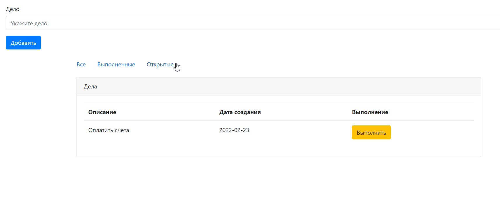

# Job4j. Проект "Список дел".

Учебный в рамках курса job4j. 
Цель проекта, применить Hibernate, на практике.
Технологии: Java , Servlets, Hibernate, Postgres
Реализованные возможности:

-Создание/выполнения дела

